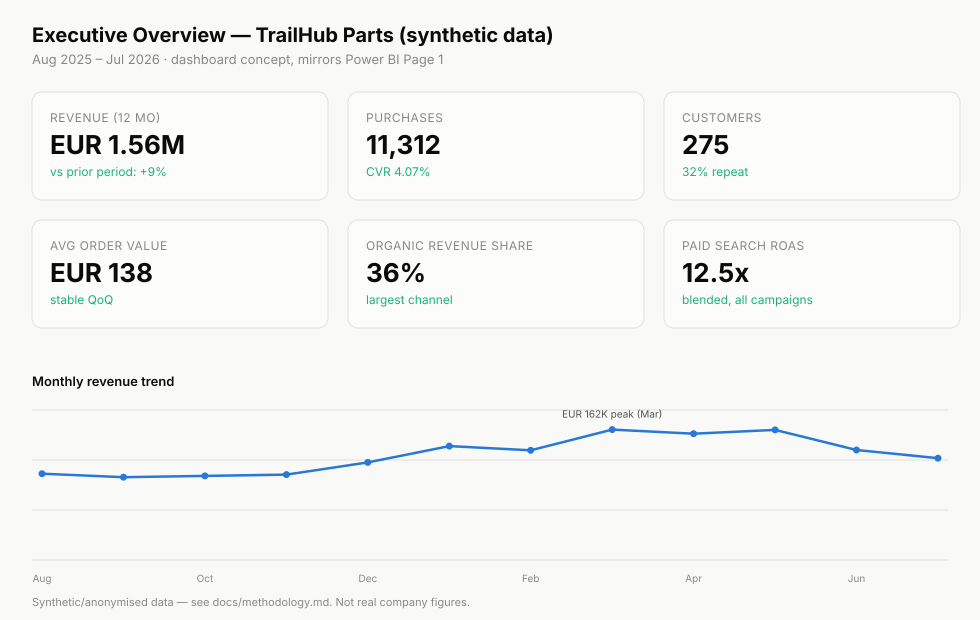
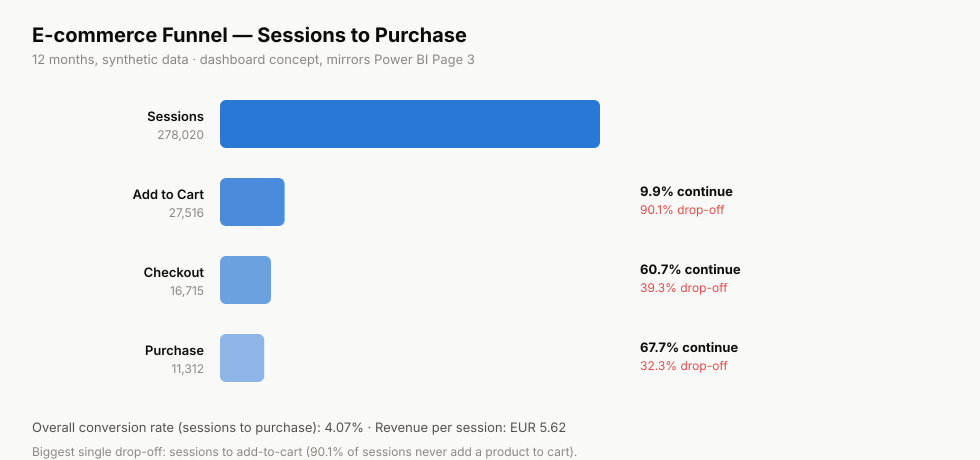

# E-commerce Performance Analytics

Full-funnel analysis of a synthetic e-commerce business: sales, SEO, paid
acquisition, customer behaviour, conversion, and revenue, tied together so
acquisition, behaviour and revenue can actually be connected instead of
analysed in silos.

> This project uses synthetic/anonymised data inspired by real-world
> e-commerce and data analytics scenarios. No confidential company data is
> included. See [docs/methodology.md](docs/methodology.md) for how the data
> was built and its limitations.

## Business Problem

A mid-size e-commerce retailer ("TrailHub Parts", fictional, 4x4/auto parts
catalogue) wants to know where revenue is actually coming from, where the
funnel leaks, and which fixes would move the numbers rather than just look
good in a report. The brief mirrors a real one: marketing, product, and BI
each hold a piece of the answer, and the value is in connecting them.

## Objectives

- Quantify sales performance by product, category and customer segment.
- Measure the full acquisition-to-revenue funnel and locate the biggest drop-off.
- Compare channel performance (organic, paid, direct, referral, social, email).
- Turn findings into recommendations with an estimated business impact, not
  just observations.

## Dataset

| Table | Rows | Grain |
|---|---|---|
| `data/products.csv` | 150 | 1 row per SKU |
| `data/customers.csv` | 320 | 1 row per customer |
| `data/orders.csv` | 650 | 1 row per order (representative sample) |
| `data/website_daily.csv` | 365 | 1 row per day, full-site funnel |

Full detail, generation logic and limitations: [docs/methodology.md](docs/methodology.md).

## Methodology

1. Data quality checks (missing values, duplicates, referential integrity, outliers)
2. Sales performance (revenue, margin, category/product concentration)
3. Customer analysis (segments, geography, device, RFM, acquisition value)
4. Funnel analysis (conversion rate per step, monthly trend, drop-off)
5. Acquisition analysis (channel mix, trend, performance by segment)
6. Findings translated into recommendations with estimated impact

## Data Architecture

```text
Acquisition (SEO / SEA / Direct / Referral / Social / Email)
        │
        ▼
   Website Funnel (sessions → views → cart → checkout → purchase)
        │
        ▼
      Orders  ──────────────►  Products (category, price, cost, stock)
        │
        ▼
    Customers (segment, geography, device, repeat behaviour)
        │
        ▼
   SQL + Python analysis  ──►  Dashboard  ──►  Findings  ──►  Recommendations
```

## Tools

Python (pandas, numpy), SQL (SQLite/PostgreSQL-compatible), Jupyter, and a
Power-BI-style dashboard concept (built as SVG so it renders directly on
GitHub — see [Dashboard](#dashboard)).

## Analysis

| Area | File |
|---|---|
| Data cleaning | [`python/data_cleaning.py`](python/data_cleaning.py) |
| Sales SQL | [`sql/sales_analysis.sql`](sql/sales_analysis.sql) |
| Customer SQL | [`sql/customer_analysis.sql`](sql/customer_analysis.sql) |
| Acquisition SQL | [`sql/acquisition_analysis.sql`](sql/acquisition_analysis.sql) |
| Funnel SQL | [`sql/funnel_analysis.sql`](sql/funnel_analysis.sql) |
| Funnel Python | [`python/funnel_analysis.py`](python/funnel_analysis.py) |
| Full walkthrough notebook | [`notebooks/01_sales_and_funnel_analysis.ipynb`](notebooks/01_sales_and_funnel_analysis.ipynb) |

Example — full funnel with conversion rate at each step
(`sql/funnel_analysis.sql`):

```sql
SELECT
    SUM(sessions)       AS sessions,
    SUM(add_to_cart)    AS add_to_cart,
    SUM(checkout)       AS checkout,
    SUM(purchases)      AS purchases,
    ROUND(100.0 * SUM(purchases) / NULLIF(SUM(sessions), 0), 2) AS overall_conversion_rate_pct,
    ROUND(SUM(revenue) / NULLIF(SUM(sessions), 0), 2)           AS revenue_per_session
FROM website_daily;
```

The funnel:

```text
Sessions (278,020)
    ↓  9.9% add a product to cart
Add to Cart (27,516)
    ↓  60.7% start checkout
Checkout (16,715)
    ↓  67.7% complete payment
Purchase (11,312)
```

## Key Findings

1. **Mobile brings more traffic than desktop (377K vs. 298K sessions) but
   converts at less than half the rate** (3.13% vs. 6.60%), with checkout
   completion 17 points lower on mobile.
2. **90.1% of sessions never add a product to cart** — the funnel's biggest
   leak is before the cart, not at checkout.
3. **The top 10% of SKUs (15 of 150 products) generate 30.6% of revenue** —
   effort spread evenly across the catalogue is diluted.
4. **Organic search is the largest channel by revenue (36% share)**, and
   **referral converts best per session (4.82%)** despite being the smallest
   channel by volume.

Full detail with business impact and estimated outcome for each:
[docs/business_recommendations.md](docs/business_recommendations.md).

## Recommendations

| Finding | Recommendation |
|---|---|
| Mobile converts at half the desktop rate | Audit mobile checkout specifically (form length, payment visibility, autofill) |
| 90% drop-off before cart | Prioritise search/filter relevance and product-page content over further checkout redesign |
| Revenue concentrated in 15 SKUs | Build a standing top-20-by-revenue watchlist for stock and SEO priority |
| Referral converts best, smallest volume | Identify and formalise the specific referral sources driving that rate |

## Dashboard

Dashboard concept (SVG, built from the numbers above — GitHub renders these
inline, no Power BI installation needed to view them):

**Executive Overview**



**E-commerce Funnel**



## Project Structure

```text
ecommerce-performance-analytics/
├── README.md
├── data/
│   ├── products.csv
│   ├── customers.csv
│   ├── orders.csv
│   └── website_daily.csv
├── sql/
│   ├── sales_analysis.sql
│   ├── customer_analysis.sql
│   ├── acquisition_analysis.sql
│   └── funnel_analysis.sql
├── python/
│   ├── data_cleaning.py
│   └── funnel_analysis.py
├── notebooks/
│   └── 01_sales_and_funnel_analysis.ipynb
├── dashboard/
│   ├── executive_overview.svg
│   └── funnel_dashboard.svg
└── docs/
    ├── methodology.md
    └── business_recommendations.md
```

## How to Run

```bash
# Python analysis
pip install pandas numpy
python python/data_cleaning.py
python python/funnel_analysis.py

# Notebook
jupyter notebook notebooks/01_sales_and_funnel_analysis.ipynb

# SQL — load the CSVs into SQLite (or any relational DB) and run the
# scripts in sql/, e.g. with the sqlite3 CLI:
sqlite3 trailhub.db <<'EOF'
.mode csv
.import data/orders.csv orders
.import data/products.csv products
.import data/customers.csv customers
.import data/website_daily.csv website_daily
EOF
sqlite3 trailhub.db < sql/sales_analysis.sql
```

## Limitations

- Synthetic data: realistic relationships and seasonality, but not real
  customer behaviour. See [docs/methodology.md](docs/methodology.md).
- `orders.csv` is a representative sample, not a full-year reconciliation of
  `website_daily.csv` — that's intentional, see methodology.
- Dashboard images are SVG recreations of a Power BI layout, not `.pbix`
  exports (see [`sales-bi-powerbi`](https://github.com/felix4000/sales-bi-powerbi)
  for the dedicated Power BI-focused project).

## About the Author

**Felix Ibeh** — Data Analyst working across BI, e-commerce analytics, SEO
and paid acquisition. Currently Data Analyst at Groupe Cipanguo, previously
Data Analyst (SEO/SEA) at Euro4x4parts.

[LinkedIn](https://www.linkedin.com/in/felix-ibeh-data-analyst/) ·
[CV](https://felix4000.github.io/felix-ibeh-cv/) ·
[GitHub](https://github.com/felix4000)
